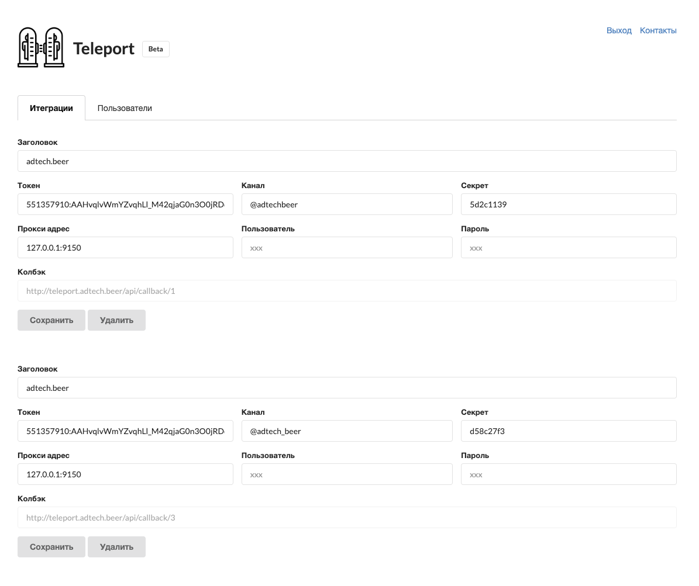

# Teleport

Телепортирует посты из ВКонтакте а Телеграм. Это селф-хостетд сервис, который можно поднять на любом VPS сервере.



Для добавления нового канала и новой группы заполняем форму:
- **Заголовок** - заполняем как хотим, лучше всего написать название сообщества.
- **Токен** - это маркер, который вы получили при создании телеграм бота. Например: 926000356:AAE8VatoXTPkPVM-2Sf4vhum_2UBl5JFE2c
- **Канал** - название вашего канала с @ в начале, например @adtech
- **Секрет** - строка, которую должен вернуть сервер при вызове из  Callback API. Эта строка указана на странице настроек группы

Есть готовый Docker образ и запустить сервис можно одной строчкой. Но сначала добавим нового пользователя:

```
docker run -p 8080:8080 -v $(pwd)/data:/data horechek/teleport teleport -database=/data/teleport.db users add --email=test@gmail.com --pass=123
```

Теперь можно запускать сам сервис:

```
docker run -p 8080:8080 -v $(pwd)/data:/data horechek/teleport teleport -database=/data/teleport.db server
```

Переходим по адресу [http://localhost:4200](http://localhost:4200/) в браузере и видим форму авторизации. Нужно указать емейл и пароль которые использовались при добавлении нового пользователя(--email=test@gmail.com --pass=123)

Для настроек используется база SQLIite, все данные будут храниться в отдельном файле.

